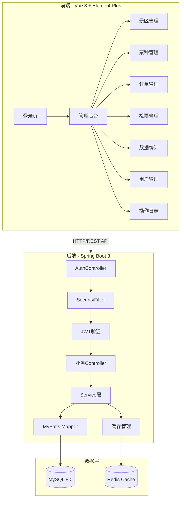
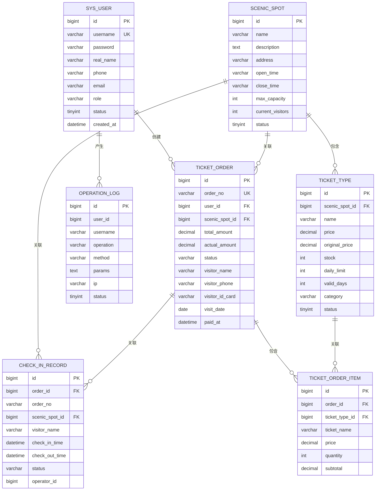
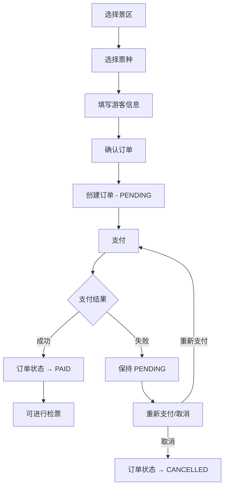
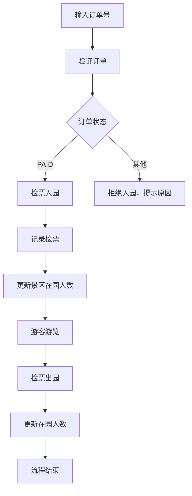
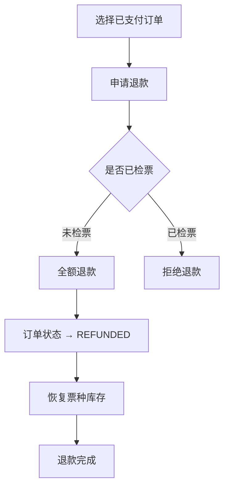

# 项目设计文档 - 景区票务管理系统

## 1. 系统架构

## 2. 数据模型

## 3. 接口清单

### 认证模块
- `POST /api/auth/login` - 用户登录（返回 JWT Token）
- `POST /api/auth/logout` - 用户退出
- `GET  /api/auth/info` - 获取当前用户信息

### 景区管理模块
- `GET    /api/scenic-spots` - 景区列表（分页）
- `GET    /api/scenic-spots/{id}` - 景区详情
- `POST   /api/scenic-spots` - 新增景区
- `PUT    /api/scenic-spots/{id}` - 修改景区
- `DELETE /api/scenic-spots/{id}` - 删除景区
- `PUT    /api/scenic-spots/{id}/status` - 启用/禁用景区

### 票种管理模块
- `GET    /api/ticket-types` - 票种列表（分页）
- `GET    /api/ticket-types/{id}` - 票种详情
- `POST   /api/ticket-types` - 新增票种
- `PUT    /api/ticket-types/{id}` - 修改票种
- `DELETE /api/ticket-types/{id}` - 删除票种
- `PUT    /api/ticket-types/{id}/status` - 上架/下架票种
- `PUT    /api/ticket-types/{id}/stock` - 调整库存

### 订单管理模块
- `GET    /api/orders` - 订单列表（分页，支持多条件筛选）
- `GET    /api/orders/{id}` - 订单详情
- `POST   /api/orders` - 创建订单（售票）
- `PUT    /api/orders/{id}/pay` - 订单支付
- `PUT    /api/orders/{id}/cancel` - 取消订单
- `PUT    /api/orders/{id}/refund` - 订单退款
- `GET    /api/orders/{orderNo}/check` - 验证订单（检票用）

### 检票管理模块
- `POST   /api/check-in` - 检票入园
- `PUT    /api/check-in/{id}/check-out` - 检票出园
- `GET    /api/check-in/records` - 检票记录列表（分页）
- `GET    /api/check-in/today` - 今日检票统计

### 数据统计模块
- `GET /api/statistics/overview` - 总览数据（总收入、总订单、今日游客等）
- `GET /api/statistics/sales` - 销售趋势（按日/周/月）
- `GET /api/statistics/ticket-types` - 票种销售占比
- `GET /api/statistics/visitors` - 游客趋势
- `GET /api/statistics/scenic-spots` - 各景区数据对比

### 用户管理模块
- `GET    /api/users` - 用户列表（分页）
- `POST   /api/users` - 新增用户
- `PUT    /api/users/{id}` - 修改用户
- `DELETE /api/users/{id}` - 删除用户
- `PUT    /api/users/{id}/status` - 启用/禁用用户
- `PUT    /api/users/{id}/reset-password` - 重置密码

### 操作日志模块
- `GET /api/logs` - 操作日志列表（分页）

## 4. 页面清单

| 页面 | 路径 | 功能描述 |
|------|------|---------|
| 登录页 | `/login` | 用户名密码登录，JWT 认证 |
| 数据总览 | `/dashboard` | 核心数据卡片 + 销售趋势图 + 票种占比图 + 游客趋势 |
| 景区管理 | `/scenic` | 景区 CRUD 列表，支持启用/禁用 |
| 票种管理 | `/ticket` | 票种 CRUD 列表，支持上架/下架、库存调整 |
| 订单管理 | `/order` | 订单列表（多条件筛选），支持售票/支付/取消/退款 |
| 检票管理 | `/checkin` | 检票入园/出园操作，今日检票统计 |
| 用户管理 | `/user` | 系统用户 CRUD，角色分配，重置密码 |
| 操作日志 | `/log` | 操作日志查询，支持时间范围筛选 |

## 5. 前端设计规范（遵循 frontend-master 标准）

### 5.1 设计方向
- 美学风格：现代专业 + 自然清新 — 结合景区主题，使用自然色系与现代化管理界面的融合
- 设计关键词：专业、清新、自然、高效、沉浸

### 5.2 色彩体系
- 主色 (Primary)：`#2563EB`（天空蓝）— 导航、主要按钮、链接
- 辅色 (Secondary)：`#059669`（翠绿色）— 成功状态、自然主题强化
- 强调色 (Accent)：`#F59E0B`（琥珀金）— 重要提示、票务金色主题
- 中性色阶梯：`#F8FAFC`(50) / `#F1F5F9`(100) / `#E2E8F0`(200) / `#CBD5E1`(300) / `#94A3B8`(400) / `#64748B`(500) / `#475569`(600) / `#334155`(700) / `#1E293B`(800) / `#0F172A`(900) / `#020617`(950)
- 语义色：Success `#10B981` / Warning `#F59E0B` / Error `#EF4444` / Info `#3B82F6`
- 60-30-10 分配：60% 浅灰背景 / 30% 白色卡片 / 10% 蓝色强调

### 5.3 字体体系
- 标题字体：Noto Serif SC（思源宋体）— 中文标题有文化质感
- 正文字体：DM Sans + Noto Sans SC — 正文清晰易读
- 字号阶梯：xs(12px) / sm(14px) / base(16px) / lg(18px) / xl(20px) / 2xl(24px) / 3xl(30px) / 4xl(36px)
- 行高：正文 1.6 / 标题 1.2-1.3
- 字重：Regular(400) / Medium(500) / Semibold(600) / Bold(700)

### 5.4 间距与布局
- 基准单位：4px
- 间距阶梯：4 / 8 / 12 / 16 / 24 / 32 / 48 / 64
- 布局方案：左侧固定侧边栏(240px) + 右侧弹性内容区
- 响应式断点：sm(640px) / md(768px) / lg(1024px) / xl(1280px) / 2xl(1536px)

### 5.5 组件规范
- 圆角：sm(4px) / md(8px) / lg(12px) / xl(16px) / full(9999px)
- 阴影层级：sm(0 1px 2px) / md(0 4px 6px) / lg(0 10px 15px) / xl(0 20px 25px)
- 卡片样式：白色背景 + md 阴影 + lg 圆角 + hover 时阴影提升
- 按钮四态：Default → Hover(亮度+5%) → Active(亮度-5%) → Disabled(opacity 0.5)

### 5.6 动效规范
- 过渡时长：快(150ms) / 中(250ms) / 慢(400ms)
- 缓动函数：`cubic-bezier(0.4, 0, 0.2, 1)` 默认 / `cubic-bezier(0, 0, 0.2, 1)` 进入 / `cubic-bezier(0.4, 0, 1, 1)` 离开
- 三层动效：
  - 页面级：路由切换 fade + slide-up 过渡，首屏卡片 staggered reveal
  - 区块级：数据卡片入场从下方淡入，列表行交错入场(stagger 50ms)
  - 元素级：按钮 hover scale(1.02) + shadow 提升，输入框 focus 蓝色边框过渡

### 5.7 平台适配说明
- 目标平台：Web 桌面端管理后台
- 交互范式：鼠标 hover + 键盘快捷键
- 最小支持宽度：1024px
- 推荐宽度：1280px+

## 6. 核心业务流程

### 售票流程

### 检票流程

### 退款流程

